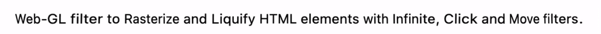

<h1 align="center">Liquify js</h1>

<p align="center">

<p>

<p align="center">
<a href="https://travis-ci.org/seeren/liquify-js">

</a>
<a href="https://coveralls.io/github/seeren/liquify-js?branch=master">

</a>
<a href="https://www.codacy.com/gh/seeren/liquify-js/dashboard?utm_source=github.com&amp;utm_medium=referral&amp;utm_content=seeren/liquify-js&amp;utm_campaign=Badge_Grade">

</a>
<a href="https://www.npmjs.com/package/liquify-js">

</a>
<a href="https://www.npmjs.com/package/liquify-js">

</a>
<p>

* * *

## Demo

Try Liquifys filter by visiting the GitHub Pages:  <https://seeren.github.io/liquify-js/demo.html>.

* * *

## Install

Install with npm.

```bash
npm install liquify-js
```

Include JavaScript file as bundle.

```html
<script src="./node_modules/liquify-js/dist/liquify.js"></script>
```

* * *

## 💧 Usage

Add `data-liquify` custom attribute to an HTMLElement. Without value the attribute apply the filter "infinite" with default settings.

```html
<div data-liquify>Liquified</div>
```

-   The default filter `infinite` provide a wrap effect without interaction.

```html
<div data-liquify="infinite">Default filter</div>
```

<p align="center">

<p>

-   The filter `click` trigger the effect when a click is emit

```html
<div data-liquify="click">Click filter</div>
```

<p align="center">

<p>

-   The filter `move` trigger the effect when a mouse move is emit

```html
<div data-liquify="move">Move filter</div>
```

<p align="center">

<p>


The document can be upgraded programmatically.

```js
window.Liquify.upgrade()
```

The `upgrade` method provide a Promise.

```js
window.Liquify
     .upgrade()
     .then((() => console.log('DOM Liquified')))
```

* * *

## ⚙️ Options

Options `frequency`, `degree` and `amplitude` can be configured using attributes.

```html
<div data-liquify
     data-frequency="0.5"
     data-degree="55"
     data-amplitude="0.5">Common option</div>
```

-   Frequency default range is 0 to 1.
-   Amplitude default range is 0 to 1.
-   Degree range is 0 to 360.

Options `duration` and `distance` can be configured using attributes.

```html
<div data-liquify="click"
     data-duration="5"
     data-distance="75">Gesture options</div>
```

-   Duration is in seconds.
-   Distance range is 0 to 100.

Options can be configured dynamically using the Liquify property of the HTMLElement.

```js
const element = window.document.querySelector("[data-liquify]");
element.Liquify.frequency = 0.5;
element.Liquify.degree = 55;
element.Liquify.amplitude = 0.5;
```

* * *

## 🎓 License

This project is licensed under the [MIT](LICENSE) License.
